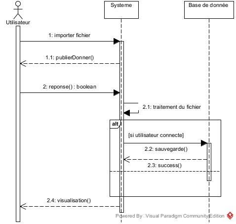

# Design application

  

 Cette application à pour objectif de permettre la visualisation et l'édition de données sous la forme de diagrammes à bulles interactif. (<a href="#image">Voir image plus haut</a>) 

 Cet outils de visualisation prendra en entrée un fichier texte dans un format spécifique à l'outil et affichera le contenu de ce fichier sous la forme d'un diagramme à bulles.

## Diagramme de cas d'utilisation

  

Ce diagramme illustre les différentes actions, que peut faire l'utilisateur sur notre application. En effet l'utilisateur à la possibilité d'importer un fichier de type json ([fichier json](./docs/test_simple.json)) contenant les différente données à visualiser. Il a la possibilité de choisir un template (diagramme pré-conçu dans l'application) pour la visualisation. Cette application accorde la possibilité de manipuler les données, soit directement dans le fichier (lorsque l'utilisateur n'est pas connecté), soit en base de donnée. L'utilisateur peut donc modifier le texte contenu dans les bulles, ou les bulles elles-même (taille, couleur). Ensuite il a aussi la capcité de déployer ou de cacher les enfants d'une bulle parent, exporter sous forme de fichier texte, le sous enfant des bulles sélectionnées ou sous forme d'image le diagramme à bulle ne contenant que les bulles sélectionnées, ainsi que les bulles supérieurs qui les relies. Si l'utilisateur désir désir consulter son historique il doit impérativement se connecter. 

## Diagramme de classe

  

Ce diagramme présente les différentes entités de notre application. Notre application possède cinq entités dont les data qui représente la donnée de chaque bulle. Elle est extraire du fichier importer par l'utilisateur. Ces données sont liées à un fichier et un fichier possède zéro ou plusieur données. Un utilisateur peut enregistrer zéro ou plusieurs fichier. Dans notre notre système nous proposons des modèle à l'utilisateur, ces modèles sont enregistrés dans la table diagramme. Un diagramme est lié à zéro ou plusieur fichier et un fichier est lié à zéro ou un diagramme 

## Diagramme de séquence

  

Lorsq'un utilisateur veut importer un fichier, le système demande si ce fichier dooit être public ou pas. Puis le système se charge de traiter le fichier, c'est-à-dire de vérifier si le  fichier corresponds au format recommandé, la taille et le type de fichier, puis si l'utlisateur est connecté son fichier enregistrer dans la base de donnée, pour facilité l'affichage de ses historiques (<a href="#usecase">Voir plus de détail</a>). A la fin de l'enregistrement le système retourne à l'utilisateur la visualisation de ses données (diagramme à bulle). Notons ce dernier à aussi la possibilité de choisir un modèle de visualisation des données.

## Documentation du projet
  L'application Bubbles est une application de visualisation de donnée, permettant à toutes personne de visualiser ses donnée contenu dans un fichier json suivant un format bien définir  ([Voir un exemple du fichier](./docs/test_simple.json)) Avant l'importation du fichier, il sera demander à l'utilisateur si il voudrait mettre ses donnée public. Ceci permettra à d'autre utilisateur d'avoir une idée du visuelle que notre application propose lorsqu'il consulteroons les données public. L'application permettra d'interagir avec les données. En effet l'utilisateur aura la possibilité de choisir un model de diagramme ou utiliser les paramètre de visualisation définir dans son fichier json (taille, couleur, police, etc...). Il peut donc modifier la couleur des bulles, la taille, la police, les libellés des bulles.
### Présentation de quelques interfaces

  
  

### Explication du projet
