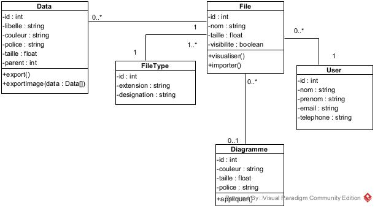

DESIGN 

Version 1.0

# Design application

  

 L'objectif de cette application est de permettre la visualisation et l'édition des données sous la forme de diagramme à bulles interactif. (<a href="#image">Voir image plus haut</a>) 

 Cet outil de visualisation prendra en entrée un fichier texte dans un format spécifique à l'outil et affichera le contenu de ce fichier sous la forme d'un diagramme à bulles.

## Documentation du projet
  Bubbles est une application de visualisation des données contenues dans un fichier json préalablement importé par l'utilisateur. Elle donne la possibilité à l'utilisateur d'interagir avec les bulles (représentation des données), en modifiant soit la couleur, la taille, la police et les libellés des bulles. Elle propose aussi à l'utilisateur un ensemble de modèle de diagramme (template) pour la visualisation des données. 
Ce dernier à donc le choix entre les modèles proposés par l'application ou utiliser les paramètres (couleur, taille, police) de visualisation définis dans son fichier json (taille, couleur, police, etc...).

  <strong style="text-decoration : underline">NB</strong> : Le fichier doit être dans un format spécifique ([Voir un exemple du fichier](./docs/test_simple.json))

### Présentation de quelques interfaces

  
  

### Explication du projet

## Diagramme de cas d'utilisation

  

  Ce diagramme illustre les différentes fonctionnalités de l'application Bubbles. 

  La fonctionnalité <strong>importer un fichier</strong> permet à l'utilisateur de charger un fichier JSON (suivant le format recommandé [fichier json](./docs/test_simple.json)) contenant les données à visualiser. Il peut choisir un template/modèle de diagramme (diagramme préconçu dans l'application) pour visualiser les données ou utiliser les paramètres de base contenus dans son fichier (<a href="#param">Voir la documentation</a>).

  <strong>La manipulation des données</strong> peut se faire de deux manières : soit directement dans le fichier (lorsque l'utilisateur n'est pas connecté), soit en utilisant la base de données. L'utilisateur à la possibilité de  modifier le texte (police, libellé) contenu dans les bulles, ainsi que les bulles elles-mêmes (taille, couleur). 

  Ensuite, il a la possibilité de <strong>déployer ou de cacher</strong> les enfants d'une bulle parente, <strong>exporter</strong> sous forme de fichier texte les sous-enfants des bulles sélectionnées ou sous forme d'image le diagramme à bulles ne contenant que les bulles sélectionnées, ainsi que les bulles supérieures qui les relient. 

  Il peut aussi <strong>consulter son historique</strong> (les données issues des fichiers importés précédemment). Cependant, cette fonctionnalité nécessite que l'utilisateur soit connecté. 

## Diagramme de classe

  

  Ce diagramme présente les différentes entités de notre application. 
  L'application comprend cinq entités dont l'entité  <strong>Data</strong> qui représente les données de chaque bulle. Ces données sont extraites du fichier importé par l'utilisateur et peuvent être exporter soit sous forme d'un fichier texte ou d'image. 

  La fonction <strong>export</strong> permet d'exporter et de présenter sous la forme d'un fichier texte l'ensemble des bulles sélectionnées. La fonction <strong>exportImage(data : Data[])</strong> permet d'exporter sous forme d’image, voir en PDF, le diagramme à bulles contenant les bulles sélectionnées, ainsi que les bulles « supérieures » qui les relies.

  Selon le diagramme les données sont liées à un fichier représenté par l'entité <strong>File</strong>. Un fichier peut contenir zéro ou plusieurs données. Il est possible de visualiser un fichier en appelant la méthode <strong>visualiser</strong> ou d'importer un fichier par la méthode <strong>importer</strong>. Un utilisateur a la possibilité d'enregistrer zéro ou plusieurs fichiers. 

  Les modèles/templates que nous présentons à l'utilisateur, sont enregistrés dans la table <strong>Diagramme</strong>. Un diagramme est lié à zéro ou plusieurs fichiers et un fichier est lié à zéro ou un diagramme.

## Diagramme de séquence

  

  Lorsqu'un utilisateur demande à importer un fichier, le système lui demande si ce fichier doit être public ou non. Ensuite, le système procède à la vérification du fichier pour s'assurer qu'il correspond au format recommandé, la taille et le type de fichier. 

  Si l'utilisateur est connecté, son fichier est enregistré dans la base de données, pour faciliter la consultation de son historique (Pour plus de détails <a href="#usecase">veuillez consulter</a>). Une fois l'enregistrement terminé, le système affiche à l'utilisateur la visualisation de ses données sous forme de diagramme à bulles.